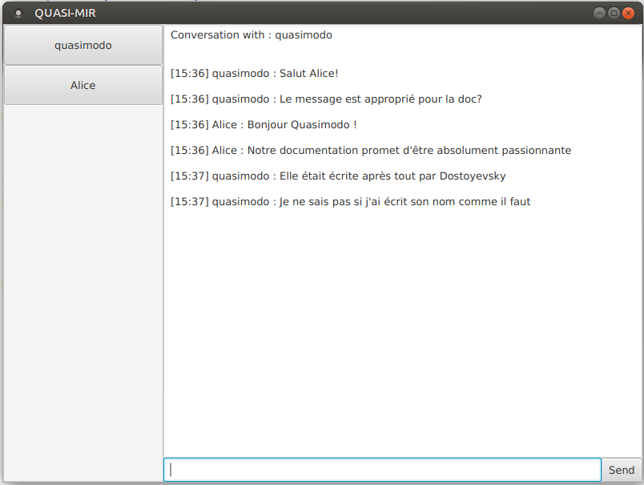

# User Guide

Welcome to the user guide of this application!

## Summary

- [Installation](#installation)
	- Download the Java archive
	- Build from Sources
	- Install MongoDB
- [System Architecture](#system-architecture)
- [Supported Features](#supported-features)
- [Connection](#connection)
	- User Discovery
	- Presence Server
- [Chat with your friends!](#chat-with-your-friends!)
	- Send messages
	- Change your pseudo


## Installation

### Download the Java archive

### Build from Sources using Maven

You can build the project from source, just download (or clone) the repository, cd to the root and type:
```
mvn package
```
It will create a `target` directory in which you will find the executable, ready to be launched.

### Install MongoDB
Install MongoDB on your operating system of choice. On Linux simply type:
```
sudo apt-get install mongodb
```
Create a directory where you can store your files. By default it is 
```
/data/db
```
Run MongoDB on localhost port 27017 by typing:
```
mongod
```
The local MongoDB database is now ready to save and retrieve messages.

## System Architecture

## Supported Features

This application currently supports:
- sending messages to other user throught TCP connection
- discovering other users using multicast frames
- connect to and communicate with a presence server, also included in the application
- let the user choose his pseudonym
- ensure unicity of pseudonyms
- let the user change his pseudonym, without losing his conversations
- save the conversations with other users, so that an history of each conversation is kept even if the app is restarted
- a nice and user-friendly UI with a notification system that let the user know when they receive a message.

There are some limitations to these features:
- Conversation saving can only be done with MongoDB installed locally.
- The pseudo cannot be changed when connecting without presence server.

## Connection

There are two ways of connecting to the application : user discovery and presence server

### User Discovery

### Presence Server

## Chat with your Friends!

### Send Messages

In order to send a message, simply click on the desired recipient in the left hand column. Then, type a message in the bottom box and click send or press enter.



### Change your pseudo

Changing a pseudonym works by selecting yourself as a message recipient. A menu will appear. Enter the new pseudonym and validate. 

This only works with a prescence server. 
