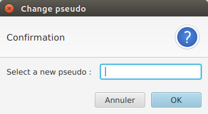

# User Guide

Welcome to the user guide of this application!

## Summary

- [Installation](#installation)
	- Download the Java archive
	- Build from Sources
	- Install MongoDB
	- Run the Application
- [System Architecture](#system-architecture)
- [Supported Features](#supported-features)
- [Connection](#connection)
	- User Discovery
	- Presence Server
	- Run the Presence Server
- [Chat with your friends!](#chat-with-your-friends)
	- Send messages
	- Change your pseudo


## Installation

### Download the Java archive

The executable archive can be found on the [release section](https://github.com/BynaryCobweb/4AS1-clavardage/releases) of this github repository.
It is called "clavardage.jar".

### Build from Sources using Maven

You can build the project from source, just download (or clone) the repository, cd to the root and type:
```
mvn package
```
It will create a `target` directory in which you will find the executable `clavardage.jar`, ready to be launched.

### Install MongoDB
Install MongoDB on your operating system of choice. On Linux simply type:
```
sudo apt-get install mongodb
```
Create a directory where you can store your files. By default it is
```
/data/db
```
Run MongoDB on localhost port 27017 by typing:
```
mongod
```
The local MongoDB database is now ready to save and retrieve messages.

### Run the Application

To run the application, simply double click on the jar from a file explorer, or type in the following command:
```
java -jar clavardage.jar
```

## System Architecture

This application has a very basic multi-tiers architecture. Data are stored in a MongoDB database,
while presence management is done by a server running on one machine. The logical tiers and the 
front tiers of the application are merged in a single client. 

In the future we can imagine more logics being moved to a distant server, making the application more
scalable.

## Supported Features

This application currently supports:
- sending messages to other user throught TCP connection
- discovering other users using multicast frames
- connect to and communicate with a presence server, also included in the application
- let the user choose his pseudonym
- ensure unicity of pseudonyms
- let the user change his pseudonym, without losing his conversations
- save the conversations with other users, so that an history of each conversation is kept even if the app is restarted
- a nice and user-friendly UI with a notification system that let the user know when they receive a message.

There are some limitations to these features:
- Conversation saving can only be done with MongoDB installed locally. If no database is found,
the application still works normally, but no messages are saved.
- The pseudo cannot be changed when connecting without presence server.

These two problems are not well signaled in the application. Better error reporting system is a top priority
for the next update! Also, the CPU usage of this application is abnormally high, and we will work on this.

## Connection

There are two ways of connecting to the application : user discovery and presence server

### User Discovery

Do not tick the check box. Enter your pseudo and click on the "Connect" button. The client will automatically 
send packets throught the network to try to find other instance of this application, and you will be able to communicate.


If there is a problem during your connection, you will see a message box with some details about the error. Then you will
be able to connect again.


### Presence Server

To connect to a presence server, enter your pseudo, and tick the check box "Se connecter à un serveur de présence"
Type in the address of the server, and the port on which the server is running. Then press "Connect".


### Run the Presence Server

It is possible to run the Presence Server from the same jar as the client. Use the following command:
```
java -cp clavardage.jar org.ljsn.clavardage.presence.PresenceServer [port]
```

## Chat with your Friends!

### Send Messages

In order to send a message, simply click on the desired recipient in the left hand column. Then, type a message in the bottom box and click send or press enter.


### Change your pseudo

Changing a pseudonym works by selecting yourself as a message recipient. A menu will appear. Enter the new pseudonym and validate. 



This only works with a presence server. 
